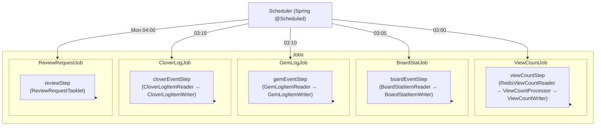
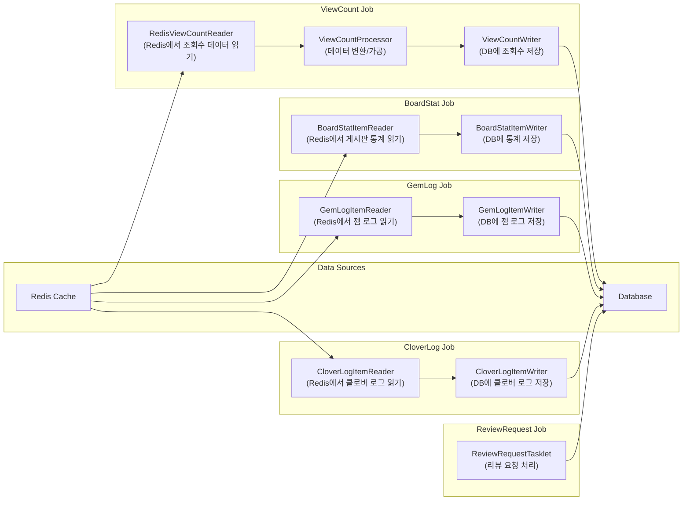
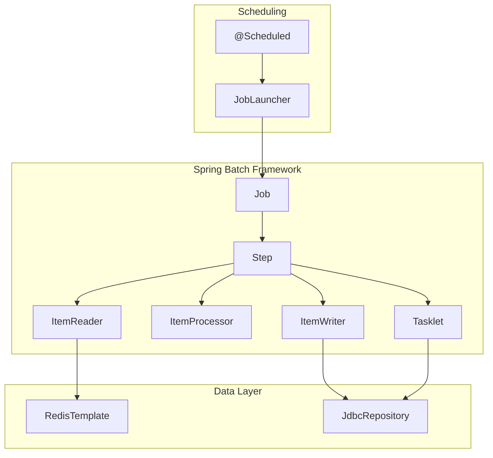

# Cluvr Batch Process Diagram

## 배치 프로세스 전체 구조

```mermaid
flowchart TD
    Scheduler["Scheduler (Spring @Scheduled)"]
    subgraph Jobs
        ViewCountJob["ViewCountJob"]
        BoardStatJob["BoardStatJob"]
        GemLogJob["GemLogJob"]
        CloverLogJob["CloverLogJob"]
        ReviewRequestJob["ReviewRequestJob"]
    end
    Scheduler -->|03:00| ViewCountJob
    Scheduler -->|03:05| BoardStatJob
    Scheduler -->|03:10| GemLogJob
    Scheduler -->|03:15| CloverLogJob
    Scheduler -->|Mon 04:00| ReviewRequestJob

    subgraph ViewCountJob
        VCStep["viewCountStep<br/>(RedisViewCountReader → ViewCountProcessor → ViewCountWriter)"]
        ViewCountJob --> VCStep
    end
    subgraph BoardStatJob
        BS_Step["boardEventStep<br/>(BoardStatItemReader → BoardStatItemWriter)"]
        BoardStatJob --> BS_Step
    end
    subgraph GemLogJob
        GL_Step["gemEventStep<br/>(GemLogItemReader → GemLogItemWriter)"]
        GemLogJob --> GL_Step
    end
    subgraph CloverLogJob
        CL_Step["cloverEventStep<br/>(CloverLogItemReader → CloverLogItemWriter)"]
        CloverLogJob --> CL_Step
    end
    subgraph ReviewRequestJob
        RR_Step["reviewStep<br/>(ReviewRequestTasklet)"]
        ReviewRequestJob --> RR_Step
    end
```

## 세부 데이터 플로우

```mermaid
flowchart LR
    subgraph "Data Sources"
        Redis["Redis Cache"]
        DB["Database"]
    end
    
    subgraph "ViewCount Job"
        VCReader["RedisViewCountReader<br/>(Redis에서 조회수 데이터 읽기)"]
        VCProcessor["ViewCountProcessor<br/>(데이터 변환/가공)"]
        VCWriter["ViewCountWriter<br/>(DB에 조회수 저장)"]
    end
    
    subgraph "BoardStat Job"
        BSReader["BoardStatItemReader<br/>(Redis에서 게시판 통계 읽기)"]
        BSWriter["BoardStatItemWriter<br/>(DB에 통계 저장)"]
    end
    
    subgraph "GemLog Job"
        GLReader["GemLogItemReader<br/>(Redis에서 젬 로그 읽기)"]
        GLWriter["GemLogItemWriter<br/>(DB에 젬 로그 저장)"]
    end
    
    subgraph "CloverLog Job"
        CLReader["CloverLogItemReader<br/>(Redis에서 클로버 로그 읽기)"]
        CLWriter["CloverLogItemWriter<br/>(DB에 클로버 로그 저장)"]
    end
    
    subgraph "ReviewRequest Job"
        RRTasklet["ReviewRequestTasklet<br/>(리뷰 요청 처리)"]
    end
    
    Redis --> VCReader
    VCReader --> VCProcessor
    VCProcessor --> VCWriter
    VCWriter --> DB
    
    Redis --> BSReader
    BSReader --> BSWriter
    BSWriter --> DB
    
    Redis --> GLReader
    GLReader --> GLWriter
    GLWriter --> DB
    
    Redis --> CLReader
    CLReader --> CLWriter
    CLWriter --> DB
    
    RRTasklet --> DB
```

## 실행 스케줄

```mermaid
gantt
    title 배치 작업 실행 스케줄
    dateFormat  HH:mm
    axisFormat %H:%M
    
    section Daily Jobs
    ViewCountJob     :03:00, 00:05
    BoardStatJob     :03:05, 00:05
    GemLogJob        :03:10, 00:05
    CloverLogJob     :03:15, 00:05
    
    section Weekly Jobs
    ReviewRequestJob  :04:00, 00:10
```

## 기술 스택

```mermaid
graph TB
    subgraph "Spring Batch Framework"
        Job["Job"]
        Step["Step"]
        Reader["ItemReader"]
        Processor["ItemProcessor"]
        Writer["ItemWriter"]
        Tasklet["Tasklet"]
    end
    
    subgraph "Data Layer"
        RedisTemplate["RedisTemplate"]
        JdbcRepository["JdbcRepository"]
    end
    
    subgraph "Scheduling"
        Scheduled["@Scheduled"]
        JobLauncher["JobLauncher"]
    end
    
    Scheduled --> JobLauncher
    JobLauncher --> Job
    Job --> Step
    Step --> Reader
    Step --> Processor
    Step --> Writer
    Step --> Tasklet
    
    Reader --> RedisTemplate
    Writer --> JdbcRepository
    Tasklet --> JdbcRepository
``` 